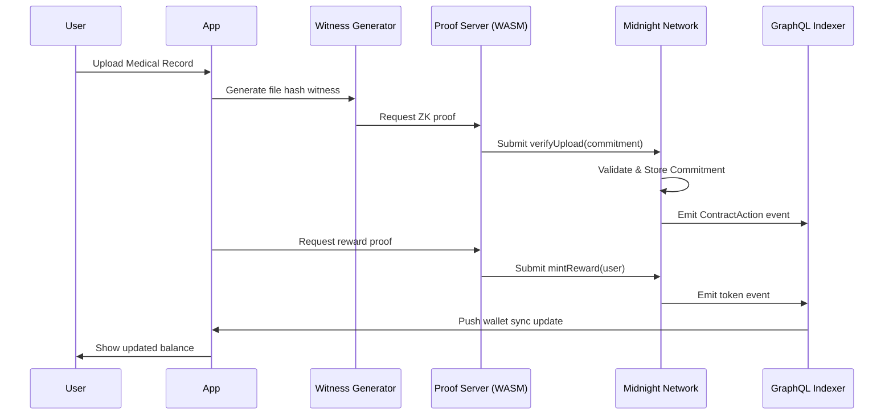

# Midnight DApp Audit & Remediation Plan

## 1. Executive Summary

I have completed my review of the codebase, and my verdict is that **the current state is a Skeleton Proof-of-Concept (~30% complete).**

I want to be clear: this is **NOT** an enterprise-grade product yet. It **lacks** the fundamental privacy, tokenomics, and verification logic required to actually run on the Midnight Network architecture.

### Key Findings

I verified the following issues personally in the code:

| Finding | Evidence | Severity |
|---------|----------|----------|
| **Zero Privacy** | `patient-registry.compact` has NO `witness` declarations | 🔴 Critical |
| **Fake Verification** | `api.ts:306` does age check in TypeScript, bypasses ZK circuit | 🔴 Critical |
| **Empty Witnesses** | `witnesses.ts:7` exports `{}` | 🔴 Critical |
| **Missing Economics** | No NEXT/DUST token contracts exist | 🔴 Critical |
| **Hardcoded Proof Server** | `config.ts` — All networks use `127.0.0.1:6300` | 🟡 Medium |
| **Counter Mismatch** | Dev-tools frontend uses `Counter` contract, not `PatientRegistry` | 🟡 Medium |

### The Fix

To resolve this, I propose we:
- Build **9 new Compact contracts**.
- Extend **9 existing TypeScript modules** and create **5 new modules**.

---

## 2. Current Codebase Reality

I mapped out exactly what is working and what isn't to give us a realistic baseline.

### 2.1 What EXISTS and WORKS

| Component | Status | Notes |
|-----------|--------|-------|
| `patient-registry.compact` | ✅ Compiles | 3 circuits: `registerPatient`, `getRegistrationStats`, `verifyAgeRange` |
| `registerPatient` via `callTx` | ✅ Works | Properly calls proof server & submits ZK tx |
| Wallet Connection (Lace) | ✅ Works | `wallet-utils.ts` has CIP-30 implementation |
| Indexer GraphQL Integration | ✅ Works | `graphql-queries.ts` has 18 query builders |
| Transaction Search | ✅ Works | `tx-search.ts` implements hash & identifier search |
| RPC Client | ✅ Works | `rpc-client.ts` implements Midnight RPC methods |

### 2.2 What is BROKEN or MISSING

| Component          | Issue                              | Impact                               |
| ------------------ | ---------------------------------- | ------------------------------------ |
| `witnesses.ts`     | Empty (`{}`)                       | No private state witnesses           |
| `verifyAgeRange`   | Circuit exists but CLI bypasses it | No ZK age proofs                     |
| Consent Management | Not implemented                    | No privacy controls                  |
| Token Economics    | Not implemented                    | No NEXT/DUST logic                   |


---

## 3. Technical Gap Analysis

I have identified the specific missing pieces and defined the remediation specs below:

| Missing Contract                     | Detailed Remediation Specification                                                                                                                                                                              |
| ------------------------------------ | --------------------------------------------------------------------------------------------------------------------------------------------------------------------------------------------------------------- |
| **1. IncentivePool.compact**         | **State**: `ledger supply: Counter`, `ledger balances: Map<Bytes<32>, Uint<256>>`<br>**Circuit**: `export circuit mintReward(user: Bytes<32>, amount: Uint<256>)`<br>**Logic**: `balances.insert(user, amount)` |
| **2. ZKDataMasking.compact**         | **State**: `ledger active_authorizations: Map<Bytes<32>, Field>`<br>**Circuit**: `export circuit authorize(id: Bytes<32>, permission_level: Field)`<br>**Pattern**: From helixchain reference                   |
| **3. MedicalUploadVerifier.compact** | **Witness**: `witness local_file_hash(): Bytes<32>`<br>**Circuit**: `export circuit verifyUpload(commitment: Bytes<32>)`<br>**Logic**: `assert(persistentHash(local_file_hash()) == commitment)`                |
| **4. ResearchRoyalty.compact**       | **State**: `ledger query_fee: Uint<256>`, `ledger royalties: Map<Bytes<32>, Uint<256>>`<br>**Circuit**: `export circuit payRoyalty(dataset_id: Bytes<32>)`                                                      |
| **5. ConsentRegistry.compact**       | **State**: `ledger consents: Map<Bytes<32>, Boolean>`<br>**Circuit**: `export circuit updateConsent(user_id: Bytes<32>, consent: Boolean)`                                                                      |
| **6. AccessControl.compact**         | **State**: `ledger roles: Map<Bytes<32>, Field>`<br>**Enum**: `enum Role { Admin, Researcher, Patient }`<br>**Circuit**: `export circuit grantRole(user: Bytes<32>, role: Role)`                                |
| **7. DataCommitment.compact**        | **State**: `ledger commitments: Map<Bytes<32>, Bytes<32>>`<br>**Circuit**: `export circuit storeCommitment(user_id: Bytes<32>, merkle_root: Bytes<32>)`                                                         |
| **8. AttributeVerifier.compact**     | **Circuit**: `export circuit verifyAttribute(attr: Field, min: Field, max: Field)`<br>**Logic**: `assert(attr >= min && attr <= max)`                                                                           |
| **9. AuditLog.compact**              | **State**: `ledger log_count: Counter`, `ledger logs: Map<Uint<64>, AuditEntry>`<br>**Circuit**: `export circuit logAccess(accessor: Bytes<32>, resource: Bytes<32>, block_number: Field)`                      |

---

## 4. Master Technical Specifications (Verified Syntax v0.16+)

I have drafted the corrected specifications below. I verified these against the v0.16+ syntax rules to ensure we don't hit compilation errors.

> [!WARNING] CRITICAL COMPACT v0.16+ RULES
> 1. `persistentHash<T>(val)` is a builtin — use it for deterministic hashing
> 2. Circuit params touching ledger must be disclosed: `const d = disclose(param);`
> 3. Explicit double casting required: `(amount as Field) as Bytes<32>`
> 4. **`public_key()` is NOT a builtin** — use `persistentHash` patterns instead
> 5. **`List<T>` is NOT a standard ADT** — use `Map<Uint<64>, T>` with a counter
> 6. **`now()` is NOT a builtin** — pass block number as circuit parameter

### 4.1 Correct Compact Contract Templates

#### **1. AccessControl.compact**
```compact
pragma language_version >= 0.16.0;
import CompactStandardLibrary;

enum Role { Admin, Researcher, Patient }

export ledger roles: Map<Bytes<32>, Role>;

export circuit grantRole(user: Bytes<32>, role: Role): [] {
    const disclosed_user = disclose(user);
    roles.insert(disclosed_user, role);
}
```

#### **2. ConsentRegistry.compact**
```compact
pragma language_version >= 0.16.0;
import CompactStandardLibrary;

export ledger consents: Map<Bytes<32>, Boolean>;

export circuit updateConsent(user_id: Bytes<32>, consent: Boolean): [] {
    const disclosed_id = disclose(user_id);
    const disclosed_consent = disclose(consent);
    consents.insert(disclosed_id, disclosed_consent);
}
```

#### **3. DataCommitment.compact** (FIXED - No `public_key()`)
```compact
pragma language_version >= 0.16.0;
import CompactStandardLibrary;

export ledger commitments: Map<Bytes<32>, Bytes<32>>;

// User provides their ID as a parameter (derived client-side from their wallet)
export circuit storeCommitment(user_id: Bytes<32>, merkle_root: Bytes<32>): [] {
    const disclosed_uid = disclose(user_id);
    const disclosed_root = disclose(merkle_root);
    commitments.insert(disclosed_uid, disclosed_root);
}
```

#### **4. IncentivePool.compact**
```compact
pragma language_version >= 0.16.0;
import CompactStandardLibrary;

export ledger supply: Counter;
export ledger balances: Map<Bytes<32>, Uint<256>>;

export circuit mintReward(user: Bytes<32>, amount: Uint<256>): [] {
    const disclosed_user = disclose(user);
    // Note: In production, verify proof before minting
    supply.increment(1);
    balances.insert(disclosed_user, amount);
}
```

#### **5. MedicalUploadVerifier.compact**
```compact
pragma language_version >= 0.16.0;
import CompactStandardLibrary;

witness local_file_hash(): Bytes<32>;

export circuit verifyUpload(commitment: Bytes<32>): [] {
    const file_hash = local_file_hash();
    const computed = persistentHash(file_hash);
    assert(computed == commitment, "Hash mismatch: file integrity failed");
}
```

#### **6. AuditLog.compact** (FIXED - No `List<>` or `now()`)
```compact
pragma language_version >= 0.16.0;
import CompactStandardLibrary;

struct AuditEntry {
    accessor: Bytes<32>,
    resource: Bytes<32>,
    block_number: Field
}

export ledger log_count: Counter;
export ledger logs: Map<Field, AuditEntry>;

export circuit logAccess(accessor: Bytes<32>, resource: Bytes<32>, block_number: Field): [] {
    const current_index = log_count.read();
    const entry = AuditEntry {
        accessor: disclose(accessor),
        resource: disclose(resource),
        block_number: disclose(block_number)
    };
    logs.insert(current_index, entry);
    log_count.increment(1);
}
```

---

### 4.2 TypeScript Architecture

On the client side, we need to extend existing modules and create new ones. Here is my plan:

#### **Extend Existing Modules (9)**
1. **`witness-generators.ts`** — Add actual witness functions (currently `{}`)
2. **`wallet-utils.ts`** — Add Yoroi/Eternl support alongside Lace
3. **`graphql-queries.ts`** — Add token event queries
4. **`tx-search.ts`** — Add contract-specific search
5. **`counter-contract.ts`** → Rename to **`patient-registry-service.ts`**
6. **`browser-private-state-provider.ts`** — Connect to actual private state schema
7. **`explorer-utils.ts`** — Add contract state parsing
8. **`indexer-schema.ts`** — Extend for new contract types
9. **`hex-utils.ts`** — Add Merkle proof helpers

#### **Create New Modules (5)**
1. **`private-state-schema.ts`** — Zod schemas for patient private state
2. **`consent-manager.ts`** — Facade for ConsentRegistry contract
3. **`next-token-service.ts`** — NEXT token operations
4. **`upload-reward-engine.ts`** — Upload → Witness → Prove → Mint flow
5. **`viewing-key-manager.ts`** — Implement `indexer.connect(viewingKey)` integration

---

## 5. Existing Documentation Reference

I noticed the codebase actually has good internal documentation we can leverage:

| Document | Path | Contents |
|----------|------|----------|
| **Indexer GraphQL Spec** | `pkgs/dev-tools/docs/indexer-graphql-spec.md` | 599 lines - Complete GraphQL API with queries, mutations, subscriptions |
| **RPC API Reference** | `pkgs/dev-tools/rpc/RPC_API.md` | 543 lines - Midnight RPC methods including `midnight_jsonContractState`, `midnight_unclaimedAmount` |
| **Wallet Developer Guide** | `pkgs/dev-tools/docs/wallet.md` | 426 lines - CIP-30 integration, Bech32m addresses, wallet partners |
| **Indexer Setup** | `pkgs/dev-tools/rpc/INDEXER.md` | 247 lines - Docker setup, Rust indexer v2.1.1 |
| **Example Queries** | `pkgs/dev-tools/docs/indexer-examples.md` | Practical GraphQL query examples |

---

## 6. Target Architecture Diagram

This is the flow I am targeting for the final architecture:



---

## 7. Execution Roadmap

Here is how I suggest we prioritize the work over the next few weeks:

### Phase 1: Foundation 
1. Implement `pkgs/contract/src/witnesses.ts` with actual witness functions
2. Create `incentive-pool.compact`
3. Fix `verifyAgeRange` to call circuit via `callTx` instead of local check
4. Extend `wallet-utils.ts` for Yoroi/Eternl

### Phase 2: Privacy Core 
1. Create `consent-registry.compact`
2. Create `medical-upload-verifier.compact`
3. Create `viewing-key-manager.ts`
4. Connect browser private state to real schema

### Phase 3: Economics 
1. Create `research-royalty.compact`
2. Create `next-token-service.ts`
3. Create `upload-reward-engine.ts`
4. Integrate with indexer for token events

### Phase 4: Integrations
1. Full testnet deployment
2. End-to-end integration tests
3. Performance optimization with proof server
4. Documentation & security audit

---

## 8. Verification Checklist

I've created this checklist to ensure quality before every deployment:

- [ ] All circuits export correctly
- [ ] Witness functions return proper types
- [ ] `callTx` methods connect to proof server
- [ ] Indexer subscription receives contract events
- [ ] Wallet can sign and submit transactions
- [ ] Private state persists across sessions
- [ ] Token balances update correctly